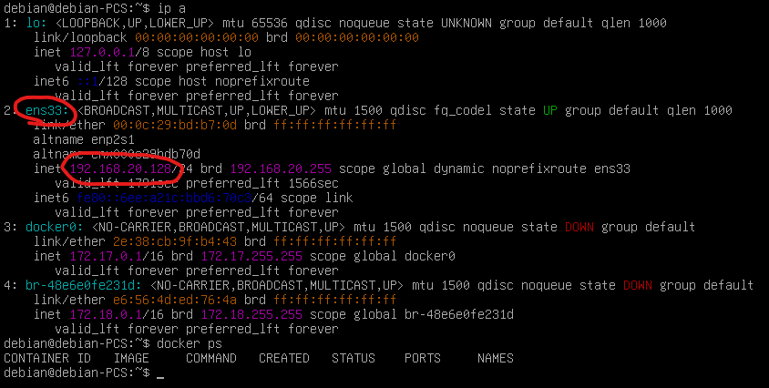

# 🚀 CloudSecure CI/CD : Pipeline d'Images Immuables

[]()
[]()
[]()

Ce projet implémente une infrastructure **CI/CD automatisée** permettant le déploiement de micro-services (Frontend & Backend) depuis un poste de contrôle vers une **VM Debian 12** via un transfert d'artefacts (Images Docker).

---

## 🏗️ Architecture du Pipeline

Le pipeline ne repose pas sur un simple `git pull` distant (sujet aux dérives), mais sur la création d'images immuables sur le nœud de build.

1.  **Déclenchement** : Webhook GitHub (Auto) ou Dashboard React (Manuel).
2.  **Build** : Compilation des Dockerfiles sur le poste local.
3.  **Export** : Sérialisation des images en archives `.tar`.
4.  **Transfert** : Injection directe dans le moteur Docker de la VM via **Stream SSH**.
5.  **Déploiement** : Nettoyage des ports et instanciation des nouveaux conteneurs.

---

## 🛠️ Pré-requis

* **Docker Desktop** (lancé sur le poste hôte)
* **VMWare** avec la VM Debian configurée
* **NGrok** (permettre la connexion webhook) : https://ngrok.com/download/windows

---

## 🚀 Installation & Lancement

## 1. Configuration de la VM
Assurez-vous d'installer la VM avec le lien de téléchargement (fichier ovf) :

1. Se connecter à la VM
```Plaintext
id = debian
mdp = debian
```
2. Récupérer l'adresse ip de la machine (récupérer celle d'ens33)
```Plaintext
ip a
```

Image d'exemple :


## 2\. Configuration du projet CI/CD

### 2.1. WebHook

Le problème est que le projet tourne sur localhost, donc GitHub (sur internet) ne peut pas le voir.
Pour palier cela, on utilise Ngrok pour créer un tunnel temporaire qui donne une URL publique au projet local.

Pour créer le lien webhook entre le projet CI/CD et le dépôt github :

1. Télécharger Ngrok et l'installer.
2. Dans un terminal, lancer :
```Plaintext
ngrok http 5001
```
3. Copier l'URL que Ngrok va générer. (ex : https://triangled-bert-vapidly.ngrok-free.dev)
4. Sur le dépôt github métier, aller dans Settings > WebHooks > Add Webhooks
5. Payload URL : Coller l'URL Ngrok et ajouter /api/webhook à la fin. (ex : https://triangled-bert-vapidly.ngrok-free.dev/api/webhook)
6. Content type : Choisir application/json. 
7. Laisser le reste par défaut et cliquer sur Add webhook.

### 2.2. Création de l’OAuth GitHub (CI/CD)

1. Afin de créer une OAuth sur github, allez sur :

GitHub → Settings → Developer settings → OAuth Apps → New OAuth App

2. Remplir les champs suivant :

- Homepage URL : http://localhost:3000/
- Callback URL : http://localhost:5001/auth/github/callback

3. Récupérer :
- Client ID
- Client Secret

### 2.3. Variables d’environnement

Créer un fichier `.env` à la racine du projet CI/CD et complétez les champs suivant :

```Plaintext
GITHUB_CLIENT_ID=votre_id_OAuth
GITHUB_CLIENT_SECRET=votre_secret_OAuth
SESSION_SECRET=votre_secret_aleatoire
VM_IP=ip_de_la_VM
```

### 2.4. Lancement

```Bash
# lancer le projet
docker compose -up -d
```

* * * * *

🔒 Sécurité & Portabilité
-------------------------

> 🚨 IMPORTANT 🚨
>
> Pour faciliter l'évaluation, les clés SSH sont incluses dans le dossier /.ssh.
>
> Note technique : Dans un environnement réel, ces clés seraient injectées via un Vault (Secrets Manager).

* * * * *

📊 Fonctionnalités Clés
-----------------------

| **Fonctionnalité** | **Description**                                                         |
| --- |-------------------------------------------------------------------------|
| **Full-Stack Build** | Build parallèle du Frontend (3000) et du Backend (5001).                |
| **Real-time Logs** | Streaming des flux de la VM vers l'interface React.               |
| **Port Cleaning** | Détection et arrêt automatique des conteneurs occupant les ports cibles. |
| **Immuabilité** | Transfert d'images `.tar` pour garantir la parité entre Dev et Prod.    |
| **Webhooks** | Intégration Ngrok/GitHub pour le déploiement continu au `git push`.     |

* * * * *

👨‍💻 Structure du Projet
-------------------------

```Plaintext
.
├── .ssh/                # Clés SSH de déploiement (Portabilité)
├── src/                 # Interface Dashboard (React)
├── workspace/           # Espace temporaire de build (Images .tar)
├── server.js            # Orchestrateur du pipeline (Node/SSH2)
└── .env                 # Configuration sensible
```


